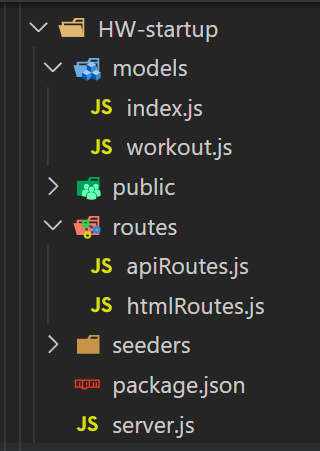

# Homework Startup..!!
## Unit 17 Nosql Homework: Workout Tracker

For this assignment, you'll create a workout tracker. You have already been provided with the front end code in the `Develop` folder. This assignment will require you to create a Mongo database with a Mongoose schema and handle routes with Express.

## Summary

For this assigment, we included the `Develop` folder which includes:
-   A Public folder with all the `Front End` files.
-   A Seeders folder with a `seed.js` file which containing the data you can use to "seed" your database.

All the Front End is already done. You are required to create the `Back End` for this application using Node, express and Mongoose. To do this, you will need to create the Server, the Models and the Routes (API and HTML).

## Recomended steps to complete this assigment.

### 1.- Create Files and Folder Structure:
-   Copy the contents of the `Develop` folder and paste it at the root level of your application folder.
-   Create a server.js at the root level of your application folder.
-   Create a "models" folder at the root level of your application folder. Inside this folder, create two files: index.js and workout.js.
-   Create a "routes" folder at the root level of your application folder. Inside this folder, create two files: htmlRoutes.js and apiRoutes.js.

Your folder structure should look like this:
 
 

### 2.- Run "npm i" to install all dependencies (npm packages).

### 3.- Run the "seeds" by runing "npm run seed" on your VS Code terminal (at the root level of your application folder).

### 4.- Work on your files:

## server.js

#### Make sure to require the following packages:
- express, logger and mongoose
#### Write code to:
- Initialize "Express" on your application.
- Create the PORT.
- Use urlencoded and json.
- Use static for your static content("public").
- Use logger for displaying a log of your routes request on your VS Code terminal.
- Connect to MongoDB.
- Require your routes (API and HTML routes)
- Listen to the PORT to run application locally.

*If you find it difficult to create the code for this file, make sure to review the content of the server file from one of our activities from "Week 9 - Day 1"*

## Models 

#### On the "index.js" file write code to:
- Require and export the "workout" model.

#### On the "workout.js" file write code to:
- Create the model for your database.
- The model should have the following fields:
-       day - type: Date and default to current date.
-       exercises - an Array of Objects.
- The fields for the objects inside the "exercises" array are:
-       type - type: String
-       name - type: String
-       duration - type: Number
-       weight - type: Number
-       reps - type: Number
-       sets - type: Number
-       distance: type: Number

*If you find it difficult to create the code for the models, make sure to review the content of the models folder and files from one of our activities from "Week 9 - Day 1"*

## Routes

#### On the "htmlRoutes.js" file write code to:
-   Create the routes to open the application's HTML pages.
-   You will need at least three html routes to render:
-       index.html ("/")
-       exercise.html ("/exersice")
-       stats.html ("/stats")

#### On the "apiRoutes.js" file write code to:
-   Create routes to handle the HTTP requests from the client and return the information from the database to the client.
-   You will need at least four api routes:
-       get ("/api/workouts") - to Read all documents from the database.
-       post ("/api/workouts") - to Create a Workout Document.
-       update ("/api/workouts/:id") - to update (add) exercises to the workout document.
-       get ("/api/workouts/range") - to Read the last 7 documents (Workouts) from the collection to be displayed in the "stats.html" page.

*If you find it difficult to create the code for the API routes with Express and Mongoose, make sure to review the content of the routes folder and files from one of our activities from "Week 9 - Day 1"*
